基于SpringBoot的网上摄影工作室（程序+论文）
=
- 完整代码获取地址：从戎源码网 ([https://armycodes.com/](https://armycodes.com/))
- 作者微信：19941326836  QQ：952045282 
- 承接计算机毕业设计、Java毕业设计、Python毕业设计、深度学习、机器学习
- 选题+开题报告+任务书+程序定制+安装调试+论文+答辩ppt 一条龙服务
- 所有选题地址https://github.com/nature924/allProject

一、项目介绍
---
基于Spring Boot框架实现的网上摄影工作室，系统包含两种角色：管理员、用户,系统分为前台和后台两大模块，主要功能如下。
### 前台：
- 首页：展示系统的概览信息和宿舍相关通知。
- 摄影作品：用户可以查看、搜索和浏览摄影作品。
- 摄影圈：用户可以在摄影圈中发表文章、评论和点赞。
- 系统公告：用户可以查看系统发布的公告信息。
- 个人中心：用户可以管理个人信息。

### 后台：
### 用户角色：
- 个人中心：用户可以管理个人信息。
- 摄影作品管理：用户可以发布、修改、删除和查看自己的摄影作品。
- 我的收藏管理：用户可以查看和管理自己的收藏信息。

### 管理员角色：
- 个人中心：管理员可以管理个人信息。
- 用户管理：管理员可以管理用户信息，
- 作品分类管理：管理员可以管理作品分类信息，
- 摄影作品管理：管理员可以管理摄影作品信息，
- 摄影圈：管理员可以管理摄影圈的文章信息，
- 系统管理：管理员可以管理系统的基本设置，上传轮播图和发布系统公告。

二、项目技术
---
- 编程语言：Java
- 数据库：MySQL
- 项目管理工具：Maven
- 前端技术：VUE、HTML、Jquery、Bootstrap
- 后端技术：Spring、SpringMVC、MyBatis

三、运行环境
---
- 操作系统：Windows、macOS都可以
- JDK版本：JDK1.8以上都可以
- 开发工具：IDEA、Ecplise、Myecplise都可以
- 数据库: MySQL5.7以上都可以
- Tomcat：任意版本都可以
- Maven：任意版本都可以

四、运行截图
---
### 论文截图：
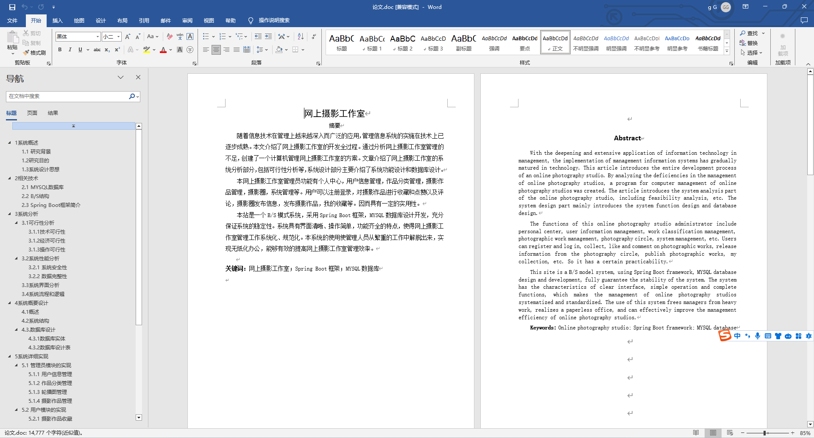
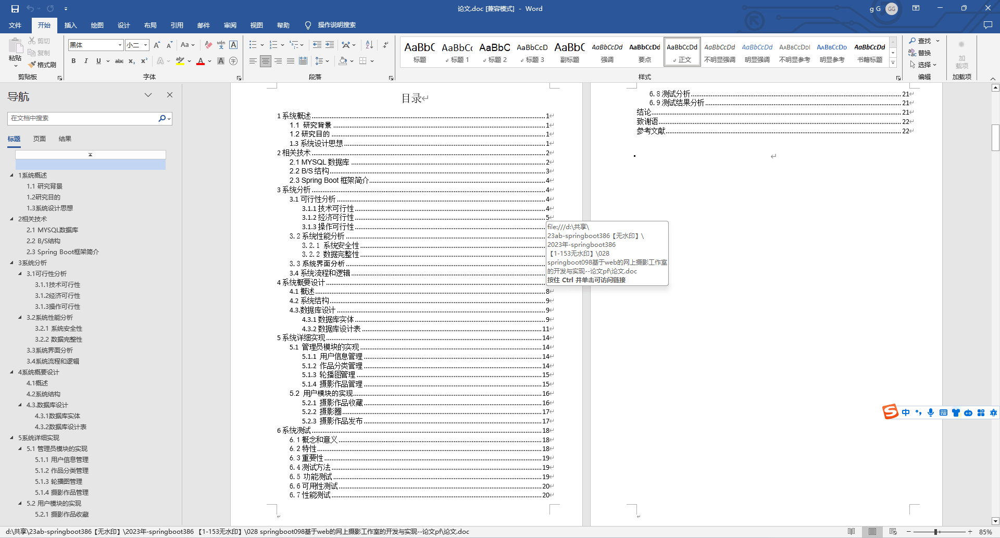

### 程序截图：

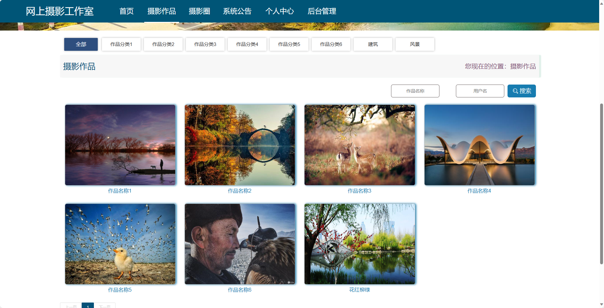
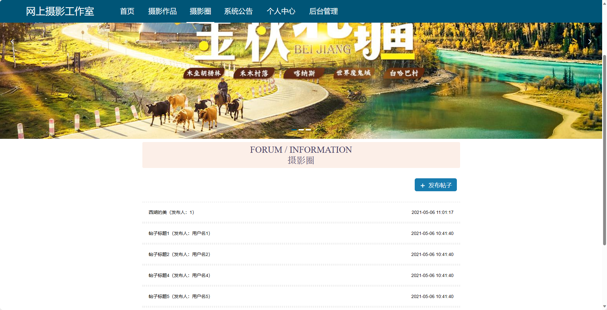
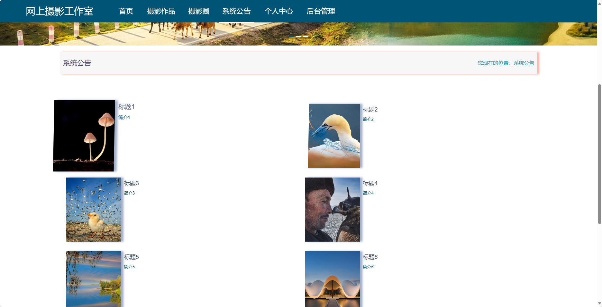
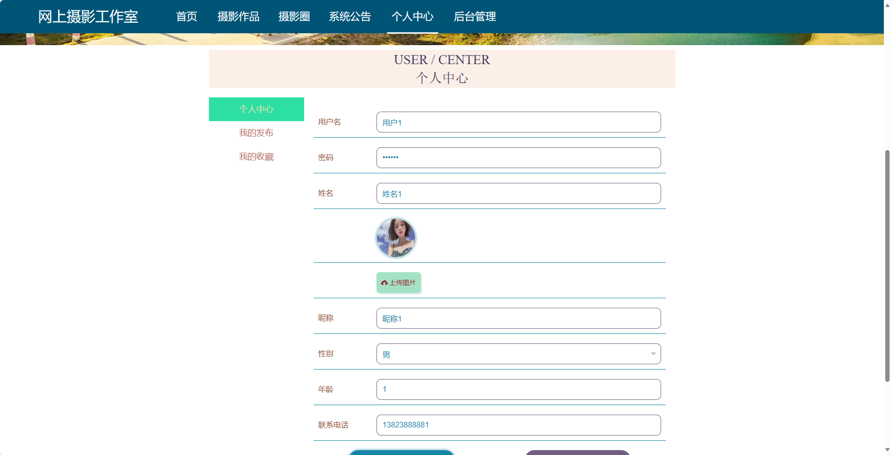
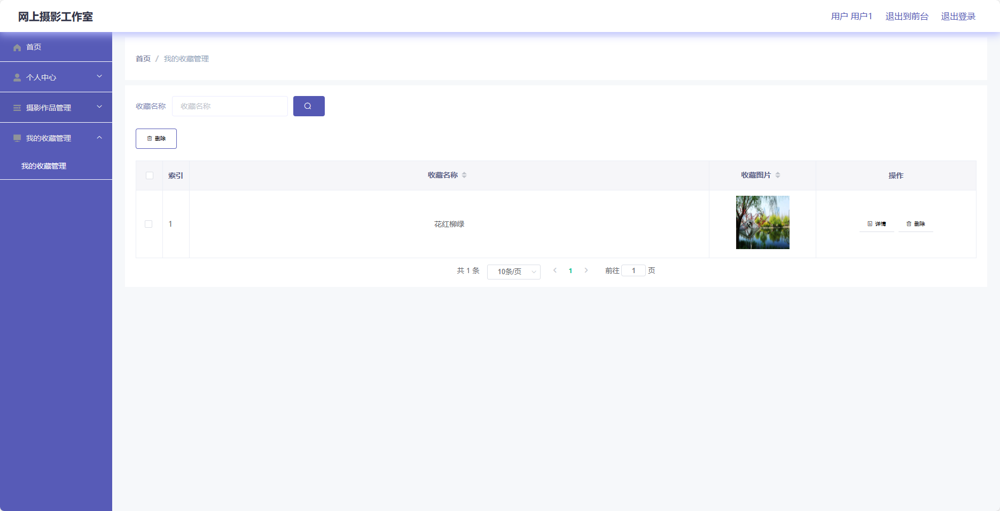
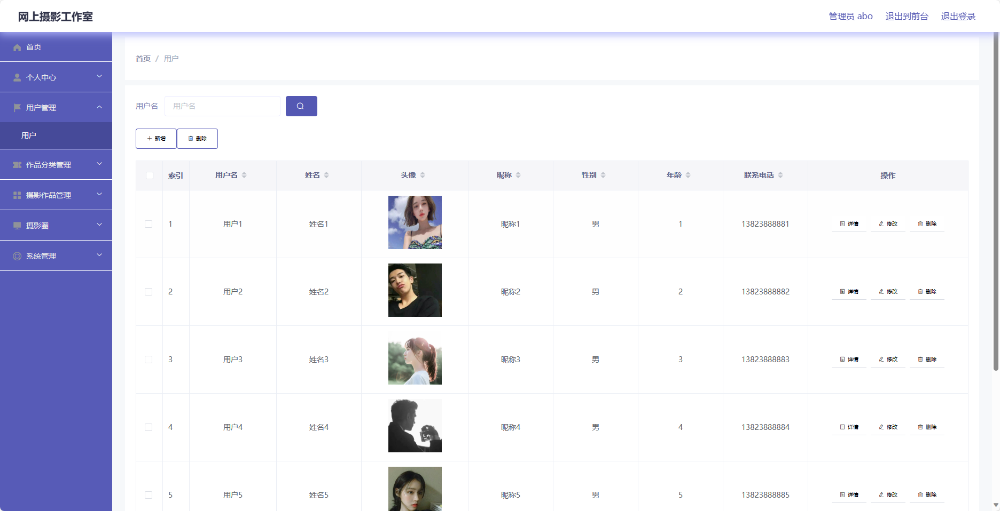
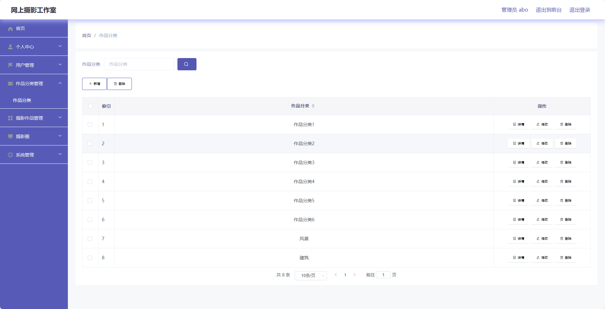
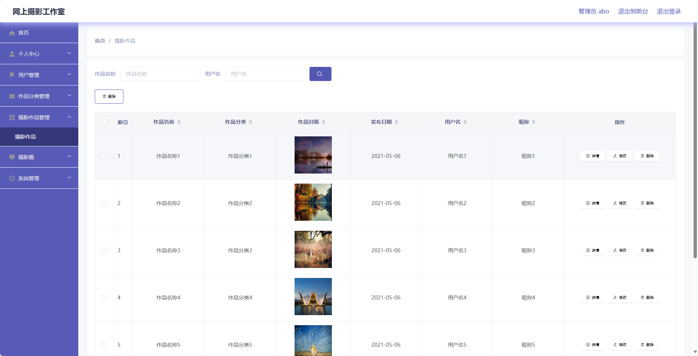
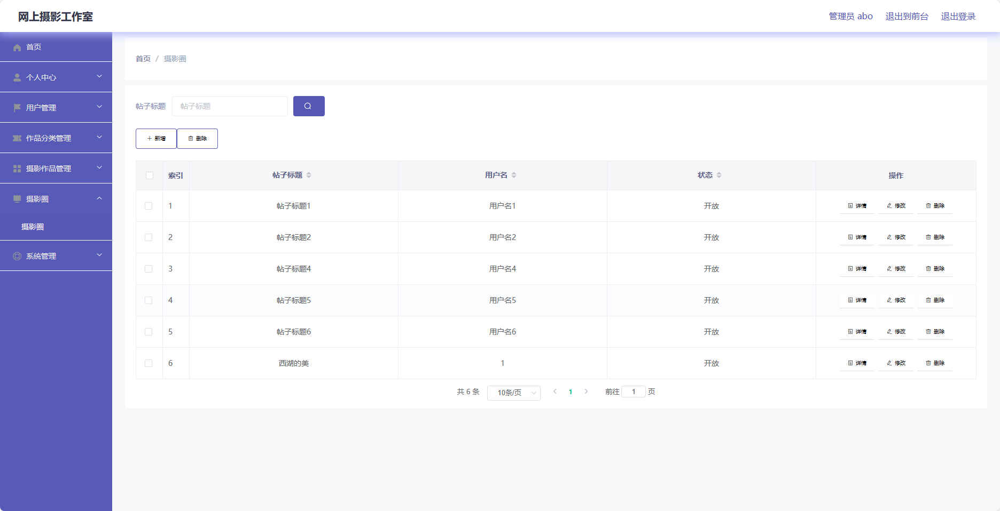

